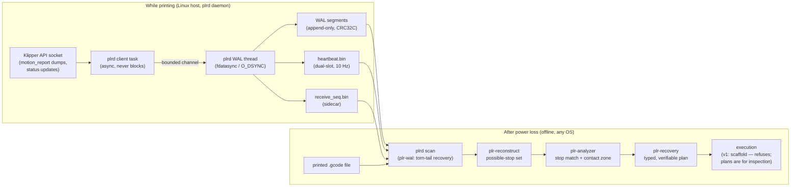

# dead-reckoning

Power-loss recovery (PLR) for Klipper 3D printers. When a printer loses power
mid-print, dead-reckoning's daemon has already journaled the motion state to a
durable write-ahead log; on restart it reconstructs the last known toolhead
position, temperatures, and G-code file offset, and builds a plan to resume
the print in place instead of scrapping it.

Two ideas anchor the design. First, a **motion WAL**: print progress is
recorded append-only with real durability guarantees (`fdatasync` / `O_DSYNC`),
so recovery works from what actually reached the disk, not from optimistic
state. Second, **part-referenced Z probing**: after a power loss the true Z
height is re-established by probing the printed part itself, so resume height
does not depend on steppers that lost their reference. All of this works
against Klipper's existing APIs — **no Klipper patches**.

- **[docs/install.md](docs/install.md)** — commissioning checklist, building
  and installing `plrd` on a Klipper host, first-run verification.
- **[docs/architecture.md](docs/architecture.md)** — the WAL formats, the
  reconstruction math, the possible-stop-set guarantee, the probe envelope,
  and the recovery-plan trust model.
- **[docs/operations.md](docs/operations.md)** — reading `plrd scan` reports,
  disk sizing, what to do after a real power loss, troubleshooting.
- **[examples/](examples/)** — a commented config for a Voron-style
  moving-bed-Z printer, a systemd override, and an end-to-end
  [recovery walkthrough](examples/recovery-walkthrough.md) with real tool
  output.

## How it works



While a print runs, `plrd` subscribes to Klipper's API socket and journals
trapezoid-queue motion, committed Z-stepper steps, print-context snapshots
(file offset, G-code interpreter state, transforms, heater/fan targets), and
liveness heartbeats. Everything hits the disk under explicit durability rules
(see [docs/architecture.md](docs/architecture.md#durability-rules)).

After an unclean stop, the offline pipeline reconstructs not a point estimate
but a **possible-stop set** — every state the machine can plausibly have
stopped in — because Klipper's motion dumps batch at ~0.5 s and step
generation runs ahead of execution, so the durable log can end before the
machine actually stopped. The Z projection of that set is exact and
enumerable; it sizes the **probe envelope** for a single, structurally
bounded probe of the printed part that re-establishes true Z without ever
re-homing Z.

## Crate map

| Crate | Kind | Purpose |
| --- | --- | --- |
| `plr-wal` | library, pure logic | Motion write-ahead log record formats, encoding/decoding, integrity checks |
| `plr-klipper` | library, pure logic | Klipper API-socket object model and protocol message parsing (no sockets) |
| `plr-gcode` | library, pure logic | G-code parsing, `gcode_move` state simulation, forward motion simulation |
| `plr-reconstruct` | library, pure logic | Possible-stop-set reconstruction from a recovered WAL |
| `plr-analyzer` | library, pure logic | Layer modeling, stop-point matching, contact-zone selection for the Z probe |
| `plr-recovery` | library, pure logic | Machine-prerequisite validation, probe-envelope arithmetic, recovery-plan generation |
| `plrd` | binary, Linux-only | The daemon: tokio, Unix sockets, durable WAL writes via rustix, systemd |

The pure-logic crates are the workspace `default-members`, so a bare
`cargo test` builds and tests exactly them on any OS. `plrd` compiles
everywhere (`cargo check -p plrd`), but on non-Linux targets the daemon is a
stub that prints an error and exits with code 3; the offline subcommands
(`plrd scan`, `plrd version`) work on every platform.

## Quick start

Full install instructions (systemd, config, commissioning checklist):
[docs/install.md](docs/install.md). The short version:

```sh
cargo build --release -p plrd
sudo cp target/release/plrd /usr/local/bin/plrd
sudo cp deploy/plrd.conf.example /etc/plrd.conf     # then edit
sudo cp deploy/plrd.service /etc/systemd/system/plrd.service
sudo systemctl daemon-reload && sudo systemctl enable --now plrd
```

After any unclean stop, inspect what the WAL knows (works on the printer or
on any machine you copy the WAL directory to):

```sh
plrd scan --wal /var/lib/plrd/wal
```

```text
plrd scan: /var/lib/plrd/wal
segment 7 (/var/lib/plrd/wal/wal-000007.plr): 16 records (trapq 8, stepper 1, context 2, marker 0, heartbeat 5)
  valid prefix ends at byte 4438: torn frame payload at end of log (expected after power loss: yes)
heartbeat /var/lib/plrd/wal/heartbeat.bin: slot A seq 212 print_time 21.2000s wal_offset 4630
...
reconstruction: RECOVERY
  crash class: host death or power loss (torn WAL tail: true)
  stop window: t_a 21.2000s .. t_b 21.9500s (t_b source: ReceiveSeq)
  Z candidates: 2
    z [0.4000, 0.4000] mm  kind Plateau  provenance Wal  known true
    ...
```

See [examples/recovery-walkthrough.md](examples/recovery-walkthrough.md) for
the full report, line-by-line, and the recovery plan generated from a
scenario like it.

## Safety guarantees — and their limits

Documented in full in [docs/architecture.md](docs/architecture.md). The
summary, stated as honestly as the code states it:

- **Possible-stop-set containment.** The true stop state is always contained
  in the reconstructed set — enforced by a fault-injection property test that
  synthesizes WALs with honest 0.5 s batch flushing, torn tails, and random
  power-cut points. *Limit:* if the printed G-code file is unavailable at
  scan time, the forward-simulated extension cannot run and the guarantee is
  **void for true power loss**; this is reported as a typed degradation, never
  silently.
- **Z is exact; the descent is structurally bounded.** The probe move happens
  inside a **shifted frame** declared via `SET_KINEMATIC_POSITION`, sized by
  the envelope formula (`expected_gap + 0.15 s × probe_speed + margin`), so
  Klipper's own rail-limit checking bounds the descent even with a faulty or
  disconnected probe. Probe speed is hard-capped to 1–2 mm/s (out-of-band
  speeds are rejected, never clamped). *Limit:* the bound protects the
  descent, not the measurement — a probe that triggers falsely still yields a
  wrong datum, which is why the plan verifies every step and aborts on any
  failed verification.
- **Z is NEVER re-homed.** On a moving-bed-Z machine there is no Z homing
  move that does not risk driving the bed into the nozzle. Plans home XY only
  (`G28 X Y`), verify that no `G28` appears after the shifted-frame
  declaration, and a guard scan strips `G28` / `Z_TILT_ADJUST` /
  `QUAD_GANTRY_LEVEL` from any user macro text recovery would execute.
- **Abort-only failure policy.** Every plan step carries machine-readable
  verification predicates; the executor contract is to never continue past a
  failed verification. There is no "retry and hope" path in v1.
- **Honest degradation.** Subscription gaps, missing file tails, adaptive
  (non-restorable) bed meshes, unparseable lines — all surface as typed flags
  or plan warnings, and several degrade to a **typed manual-recovery
  fallback** (vase mode, single wall, layer-only match…) rather than an
  unsafe automatic attempt.

## Project status (v1)

Implemented and tested:

- The recorder daemon with its durability contract, including a
  SIGKILL crash-consistency integration test of the ack ⇒ durable ordering.
- Offline scan + reconstruction (`plrd scan`), cross-platform.
- The full planning pipeline (reconstruct → analyze → plan), property-tested
  and golden-tested, producing rendered, human-reviewable plans.

Deliberately **not** in v1:

- **Plan execution is a scaffold that refuses to run.** The Moonraker
  executor (`crates/plrd/src/executor.rs`) pins down the shape but returns
  `NotImplemented` unconditionally; executing a recovery moves a hot nozzle
  around a solidified print and ships only together with its own safety
  review. In v1 you generate and inspect plans; execution is manual (see
  [docs/operations.md](docs/operations.md#after-a-real-power-loss)).
- ADXL drag probing is deferred; multi-extruder machines are out of scope.
- The MCU `CLOCK_FREQ` is not journaled yet, so reconstruction falls back to
  Klipper-converted step times (reported as a `NoMcuFrequency` anomaly).
- Empirical validation tasks **E1–E5** — real-hardware fault injection, probe
  repeatability on infill, WAL write-load measurement — are open. They are
  the recommended commissioning steps for any machine that intends to trust
  a recovery: see [docs/install.md](docs/install.md#commissioning-checklist).

## Development setup

Toolchain is pinned by `rust-toolchain.toml` (rustup installs it, plus
rustfmt/clippy/llvm-tools, automatically on first `cargo` invocation).

### Windows (native) — logic crates

Everything except `plrd`'s real runtime develops natively on Windows:

```sh
cargo test            # default members: all pure-logic crates
cargo check -p plrd   # compiles the non-Linux stub path
```

### WSL / Linux — plrd

`plrd` targets Linux (Unix sockets, `fdatasync`/`O_DSYNC`, systemd). Develop
and test it under WSL2 or a Linux box. **Clone the repo inside the WSL
filesystem (e.g. `~/src/dead-reckoning`), not under `/mnt/c`** — the 9p mount
of the Windows drive does not give real fsync semantics, and durability code
is never tested against fakes:

```sh
cargo test --workspace   # includes plrd
```

### One-time hook setup (all platforms)

```sh
sh scripts/setup-hooks.sh
```

This sets `git config core.hooksPath .githooks`. Every commit then runs, in
order and fail-fast: `cargo fmt --all --check`, clippy with `-D warnings`
(full workspace on Linux; `--exclude plrd` elsewhere), `cargo test`, and the
coverage gate.

## Tests, coverage, lints

```sh
cargo test                               # pure-logic crates (any OS)
cargo test --workspace                   # + plrd (Linux)
cargo fmt --all --check                  # formatting
cargo clippy --workspace --exclude plrd --all-targets -- -D warnings
sh scripts/coverage.sh                   # line-coverage gate, >=90%
```

Coverage uses [`cargo-llvm-cov`](https://github.com/taiki-e/cargo-llvm-cov)
(`cargo install cargo-llvm-cov` once). The script prints the summary table
and exits nonzero below 90% line coverage — the same gate CI enforces over
the full workspace on Linux. There are no exclusions; do not lower the
threshold, raise coverage.

Test fixtures live in `fixtures/synthetic/` (checked in, exercised by the
`plr-gcode`/`plr-analyzer` fixture tests) and `fixtures/real/` (drop any real
sliced `.gcode` files there; the fixture tests auto-discover them and run the
full parse + simulate + Z-scan pipeline over each).

CI (`.github/workflows/ci.yml`) runs on push/PR: full-workspace lint and
tests on Linux, default-member tests on Windows, and the coverage gate.
