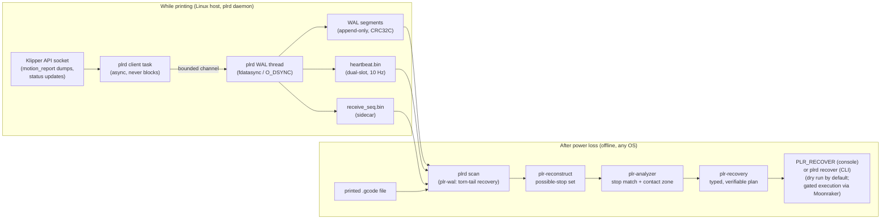

# dead-reckoning

**Power-loss recovery for Klipper 3D printers.** If your printer loses power
twenty hours into a twenty-four-hour print, dead-reckoning lets you resume
the print in place instead of throwing the part away.

It works like a flight recorder. While you print, a small background service
(`plrd`) runs on your printer's Linux host next to Klipper and continuously
journals what the printer is doing — position, file progress, temperatures —
to disk, in a way that survives having the power yanked mid-write. After a
power loss, its tools read that journal back, work out where the print
stopped, and build a step-by-step, checked recovery plan: re-find true Z by
gently touching the *printed part itself* with the nozzle (so recovery does
not depend on motors that lost their reference), re-heat, and resume from
the right line of G-code. No Klipper patches, no custom firmware — it talks
to Klipper's existing API socket.

You set it up and drive it **from the printer console**: a small
Klipper plugin adds `PLR_*` commands (`PLR_SETUP`, `PLR_STATUS`,
`PLR_RECOVER`, …) that walk you through commissioning and recovery
without leaving Mainsail/Fluidd's console.

**Honest status (v1):** the whole chain is implemented and tested —
recording, reconstruction, plan generation, and gated execution via
Moonraker (console `PLR_RECOVER`, or the equivalent CLI
`plrd recover`). Execution sits behind a deliberate stack of safety
gates: per-machine commissioning that defaults to "not commissioned"
(console attestations read from the live Klipper config), dry-run by
default, a double consent flag, and
abort-on-any-failed-verification. Treat your first execution as a
supervised commissioning run on a scrap print — the empirical hardware
validation tasks (E1–E5) are still open. See
[Project status](#project-status-v1).

## Quick install

Prerequisites: a moving-bed-Z printer that meets the
[project requirements](#project-requirements), and a Linux host (e.g.
Raspberry Pi) running Klipper. One command on the printer host (run as your
normal printer user, not root):

```sh
curl -sSL https://raw.githubusercontent.com/Zsmerritt/dead-reckoning/main/scripts/install.sh | bash
```

Prefer to read before you pipe? So do we —
[scripts/install.sh](scripts/install.sh) is short and commented; download
it, read it, then run it. It installs build prerequisites, clones the repo,
builds `plrd`, generates `/etc/plrd.conf` from your detected `printer_data`
(socket path, Z steppers), installs + starts the systemd service, and
symlinks the Klipper console plugin into your klipper checkout
(`~/klipper/klippy/extras/plr`; override with `--klipper <path>`). It
never talks to Klipper, never edits `printer.cfg`, and never restarts the
klipper or moonraker services. Add `--moonraker` to also register plrd in
Moonraker's update manager, so Mainsail/Fluidd's update panel shows and
updates it. There is a matching
[scripts/uninstall.sh](scripts/uninstall.sh).

Then finish from the printer console:

1. add a `[plr]` section to `printer.cfg` — minimally
   `[plr]` + `probe_method: tap` (commented starter:
   [examples/printer-plr-section.cfg](examples/printer-plr-section.cfg))
   — and `RESTART` Klipper;
2. type **`PLR_SETUP`** and follow its report: it checks every machine
   prerequisite with `[PASS]`/`[WARN]`/`[FAIL]` markers and tells you
   the remediation for each;
3. attest the one thing software cannot check — a self-locking Z —
   with `PLR_SETUP ACCEPT_SELF_LOCKING_Z=1`;
4. calibrate your probe method: `PLR_PROBE_TEST START=1` (tap /
   load-cell repeatability) or `PLR_NOISE_TEST START=1` (adxl_drag
   noise floor);
5. `SAVE_CONFIG`. After the restart `PLR_SETUP` reports
   `COMMISSIONED`, and `PLR_STATUS` shows both the plugin and the
   daemon state.

Manual alternative (what the script automates):

```sh
git clone https://github.com/Zsmerritt/dead-reckoning.git
cd dead-reckoning
cargo build --release -p plrd
sudo cp target/release/plrd /usr/local/bin/plrd
sudo cp deploy/plrd.conf.example /etc/plrd.conf     # then edit — at minimum klipper_socket
sudo cp deploy/plrd.service /etc/systemd/system/plrd.service
sudo systemctl daemon-reload && sudo systemctl enable --now plrd
```

Then check it is recording (`systemctl status plrd`, WAL files appearing
under `/var/lib/plrd/wal`) and, after any unclean stop, inspect what the
journal knows — from the console (`PLR_STATUS`, then `PLR_RECOVER` for a
dry-run plan) or from a shell:

```sh
plrd scan --wal /var/lib/plrd/wal      # evidence report
plrd recover --config /etc/plrd.conf   # recovery plan (dry run by default)
```

**The full guide — commissioning checklist, console commissioning
walkthrough, config editing, first-run verification, cross-compiling —
is [docs/install.md](docs/install.md).** The `PLR_*` command reference
is [klippy_plugin/README.md](klippy_plugin/README.md).
A complete worked example (record → power cut → scan → `plrd recover`,
with real tool output at every step) is
[examples/recovery-walkthrough.md](examples/recovery-walkthrough.md).

## Project requirements

dead-reckoning targets a specific machine class and refuses to plan a
recovery for anything else (`plr-recovery` validates all of this and reports
every failed check). You need:

- **A moving-bed-Z printer** (bed rises into a fixed gantry — Voron
  2.4/Trident class). Recovery **never re-homes Z**; the whole safety story
  is built around that.
- **A contact oracle that can reference the printed part** — one of:
  - a Tap-style **`[probe]`** (`probe_method: tap`) or a
    **`[load_cell_probe]`** (`probe_method: load_cell`): the probe must
    trigger on nozzle contact; inductive-only probes do not qualify.
    Probe `activate_gcode`/`deactivate_gcode` must be empty or verified
    move-free.
  - an **accelerometer drag oracle** (`probe_method: adxl_drag` + an
    `accel_chip`): the nozzle drags short lateral passes down a bounded
    Z staircase and the accelerometer detects contact
    (`PLR_DRAG_PROBE`). Honest note: its safety **bounds** (staircase
    travel floor, abort-on-unclassifiable, one-`drag_z_step` overshoot)
    are tested, but **bench validation of detection quality on real
    hardware is still open (E5)** — treat detection as unproven until
    then.
- **`[force_move]` with `enable_force_move: True`** in `printer.cfg`.
- **Self-locking Z leadscrews** (the bed must hold position unpowered) —
  an operator attestation; software cannot check this. You attest it from
  the console: `PLR_SETUP ACCEPT_SELF_LOCKING_Z=1`.
- **All Z steppers on the primary MCU** (multi-MCU Z is refused).
- **Slicer `;TYPE:` feature annotations** in your G-code — OrcaSlicer and
  PrusaSlicer (and SuperSlicer/Cura) emit them by default; recovery refuses
  to pick a probe point without them.
- **A known Z `position_min`** (or `[printer] minimum_z_position`) — it
  anchors the probe envelope.
- A Linux host for the daemon (the offline analysis tools run anywhere).

Out of scope in v1: multi-extruder machines.

## Configuration

Two configs matter — Klipper's and the daemon's:

- **`printer.cfg` `[plr]` section** — the plugin's config and the
  **authoritative machine config for recovery**: probe method, tunables,
  and the values the console commands persist via `SAVE_CONFIG`
  (attestation, probe resolution, noise floor). plrd reads it from the
  live Klipper config at recover time, so there is no separate snapshot
  to keep in sync — and no config-hash blessing ritual. Commented
  starter: [examples/printer-plr-section.cfg](examples/printer-plr-section.cfg);
  full key table: [klippy_plugin/README.md](klippy_plugin/README.md).
  What each *machine prerequisite* looks like in the rest of your Klipper
  config: [docs/install.md → Where each prerequisite lives](docs/install.md#where-each-prerequisite-lives).
- **`/etc/plrd.conf`** (flat `key = value`): the recorder daemon's own
  config — socket paths, WAL location and durability knobs; every key,
  default, and valid range is tabulated in
  [docs/install.md → Editing /etc/plrd.conf](docs/install.md#editing-etcplrdconf).
  A fully commented example for a Voron-style multi-Z machine:
  [examples/plrd.conf](examples/plrd.conf). Recording works with only
  `klipper_socket` (and, multi-Z, `z_steppers`) changed. Its `[machine]`
  section is the **legacy** (pre-plugin) commissioning path —
  deprecated-but-working, and ignored whenever a `[plr]` section exists
  ([docs/install.md → Legacy commissioning](docs/install.md#legacy-commissioning-the-machine-section)).

## Understanding the logs

Two kinds of output tell you what the system is doing:

- **Daemon logs** — `plrd` logs to stderr, which systemd routes to journald
  (`journalctl -u plrd -f`). Every message the daemon emits (connect/backoff
  lines, klippy state changes, unparseable-payload warnings, skipped
  records) is cataloged in
  [docs/operations.md → Understanding plrd's logs](docs/operations.md#understanding-plrds-logs).
- **Scan reports** — `plrd scan` prints the post-mortem analysis; the
  line-by-line field guide is
  [docs/operations.md → Reading plrd scan reports](docs/operations.md#reading-plrd-scan-reports).

---

## How it works (the deeper detail)

Two ideas anchor the design. First, a **motion WAL** (write-ahead log):
print progress is recorded append-only with real durability guarantees
(`fdatasync` / `O_DSYNC`), so recovery works from what actually reached the
disk, not from optimistic state. Second, **part-referenced Z probing**:
after a power loss the true Z height is re-established by probing the
printed part itself, so resume height does not depend on steppers that lost
their reference.



After an unclean stop, the offline pipeline reconstructs not a point
estimate but a **possible-stop set** — every state the machine can
plausibly have stopped in — because Klipper's motion dumps batch at ~0.5 s
and step generation runs ahead of execution, so the durable log can end
before the machine actually stopped. The Z projection of that set is exact
and enumerable; it sizes the **probe envelope** for a single, structurally
bounded probe of the printed part that re-establishes true Z without ever
re-homing Z. The full story, including the on-disk formats and the math:
[docs/architecture.md](docs/architecture.md).

## Safety guarantees — and their limits

Documented in full in [docs/architecture.md](docs/architecture.md). The
summary, stated as honestly as the code states it:

- **Possible-stop-set containment.** The true stop state is always contained
  in the reconstructed set — enforced by a fault-injection property test that
  synthesizes WALs with honest 0.5 s batch flushing, torn tails, and random
  power-cut points. *Limit:* if the printed G-code file is unavailable at
  scan time, the forward-simulated extension cannot run and the guarantee is
  **void for true power loss**; this is reported as a typed degradation, never
  silently.
- **Z is exact; the descent is structurally bounded.** The probe move happens
  inside a **shifted frame** declared via `SET_KINEMATIC_POSITION`, sized by
  the envelope formula (`expected_gap + 0.15 s × probe_speed + margin`), so
  Klipper's own rail-limit checking bounds the descent even with a faulty or
  disconnected probe. Probe speed is hard-capped to 1–2 mm/s (out-of-band
  speeds are rejected, never clamped). *Limit:* the bound protects the
  descent, not the measurement — a probe that triggers falsely still yields a
  wrong datum, which is why the plan verifies every step and aborts on any
  failed verification.
- **Z is NEVER re-homed.** On a moving-bed-Z machine there is no Z homing
  move that does not risk driving the bed into the nozzle. Plans home XY only
  (`G28 X Y`), verify that no `G28` appears after the shifted-frame
  declaration, and a guard scan strips `G28` / `Z_TILT_ADJUST` /
  `QUAD_GANTRY_LEVEL` from any user macro text recovery would execute.
- **Abort-only failure policy.** Every plan step carries machine-readable
  verification predicates; the executor never continues past a failed
  verification (there is no code path that does — any predicate failure,
  poll timeout, or non-finite computation aborts with a typed reason).
  There is no "retry and hope" path in v1, and everything sent and checked
  is transcribed to a JSONL file.
- **Consent-gated execution.** Recovery is a dry run unless you
  explicitly consent twice — console: `PLR_RECOVER EXECUTE=1
  CONFIRM=YES`; CLI: `plrd recover --execute --confirm` plus an
  interactive prompt. The machine must be commissioned (console
  attestations read from the live `[plr]` config — or, legacy mode,
  `[machine]` attestations plus the config-hash blessing) and the
  printer ready and idle before a single command is sent.
- **Honest degradation.** Subscription gaps, missing file tails, adaptive
  (non-restorable) bed meshes, unparseable lines — all surface as typed flags
  or plan warnings, and several degrade to a **typed manual-recovery
  fallback** (vase mode, single wall, layer-only match…) rather than an
  unsafe automatic attempt.

## Crate map

The codebase is a Rust workspace split by *platform shape*, not by trait
abstraction: pure-logic crates are cross-platform by construction, and all
syscalls and I/O live in one Linux-only daemon crate. Durability code is
**never mocked** — that is a hard project rule.

| Crate | Kind | Purpose |
| --- | --- | --- |
| `plr-wal` | library, pure logic | Motion write-ahead log record formats, encoding/decoding, integrity checks |
| `plr-klipper` | library, pure logic | Klipper API-socket object model and protocol message parsing (no sockets) |
| `plr-gcode` | library, pure logic | G-code parsing, `gcode_move` state simulation, forward motion simulation |
| `plr-reconstruct` | library, pure logic | Possible-stop-set reconstruction from a recovered WAL |
| `plr-analyzer` | library, pure logic | Layer modeling, stop-point matching, contact-zone selection for the Z probe |
| `plr-recovery` | library, pure logic | Machine-prerequisite validation, probe-envelope arithmetic, recovery-plan generation |
| `plrd` | binary, Linux-only | The daemon: tokio, Unix sockets, durable WAL writes via rustix, systemd |

The pure-logic crates are the workspace `default-members`, so a bare
`cargo test` builds and tests exactly them on any OS. `plrd` compiles
everywhere (`cargo check -p plrd`), but on non-Linux targets the daemon is a
stub that prints an error and exits with code 3; the offline subcommands
(`plrd scan`, `plrd version`) work on every platform.

## Project status (v1)

Implemented and tested:

- The recorder daemon with its durability contract, including a
  SIGKILL crash-consistency integration test of the ack ⇒ durable ordering.
- Offline scan + reconstruction (`plrd scan`), cross-platform.
- The full planning pipeline (reconstruct → analyze → plan), property-tested
  and golden-tested, producing rendered, human-reviewable plans.
- Boot-time unfinished-print detection: on startup the daemon classifies
  the previous session's WAL, writes `pending_recovery.json`, and announces
  the pending recovery on the printer console (`RESPOND`, falling back to
  `M117`).
- **Recovery execution** (`plrd recover`, console `PLR_RECOVER`): the full
  pipeline from WAL to a validated plan, then gated execution via
  Moonraker. The gate stack, in order: machine prerequisites must validate
  (commissioning **defaults to not-commissioned**; in `[plr]` mode the
  snapshot is re-read from the live Klipper config every run, in legacy
  `[machine]` mode the printer.cfg checksum must additionally match the
  blessed `validated_config_hash`); **dry run is the default** — the
  dry path provably cannot send (no network client is ever constructed);
  `--execute` requires `--confirm` *and* an interactive yes (console:
  `EXECUTE=1 CONFIRM=YES`); the printer must be ready and idle; `--step`
  asks again before every step (CLI-only). During execution every step's
  verifications must pass — any failure aborts with a typed reason — and
  everything sent, received, and evaluated is written to a JSONL
  transcript in the WAL directory.
- **The Klipper console plugin** (`klippy_plugin/plr`, the `[plr]`
  section): `PLR_SETUP` commissioning checks + attestation, `PLR_SET`
  tunables with `SAVE_CONFIG` staging, `PLR_PROBE_TEST` /
  `PLR_NOISE_TEST` calibration, `PLR_STATUS`, `PLR_RECOVER`, and the
  `PLR_DRAG_PROBE` staircase drag oracle — talking to the daemon over
  its control socket. Command reference:
  [klippy_plugin/README.md](klippy_plugin/README.md).

Known limits, stated plainly:

- **First execution = supervised commissioning.** The empirical validation
  tasks **E1–E5** — real-hardware fault injection, probe repeatability on
  infill, WAL write-load measurement — are open. Commission on a scrap
  print with your hand near the power switch, using `--step`:
  [docs/install.md](docs/install.md#commissioning-checklist).
- ADXL drag probing is implemented with tested safety bounds, but its
  detection quality is **bench-unvalidated (E5)**; multi-extruder
  machines are out of scope.
- The MCU `CLOCK_FREQ` is not journaled yet, so reconstruction falls back to
  Klipper-converted step times (reported as a `NoMcuFrequency` anomaly).
- Automation declines rather than guesses: vase mode, single-wall parts,
  layer-only matches, and mid-file exclude-object state all degrade to a
  typed manual fallback (exclude-object state is not journaled by the WAL
  format yet, so restoring exclusions after `M23` is out of scope).

## Local development setup

Toolchain is pinned by `rust-toolchain.toml` (rustup installs it, plus
rustfmt/clippy/llvm-tools, automatically on first `cargo` invocation).
See [CONTRIBUTING.md](CONTRIBUTING.md) for the contribution workflow and
quality bar.

### Windows (native) — logic crates

Everything except `plrd`'s real runtime develops natively on Windows:

```sh
cargo test            # default members: all pure-logic crates
cargo check -p plrd   # compiles the non-Linux stub path
```

### WSL / Linux — plrd

`plrd` targets Linux (Unix sockets, `fdatasync`/`O_DSYNC`, systemd). Develop
and test it under WSL2 or a Linux box. **Clone the repo inside the WSL
filesystem (e.g. `~/src/dead-reckoning`), not under `/mnt/c`** — the 9p mount
of the Windows drive does not give real fsync semantics, and durability code
is never tested against fakes:

```sh
cargo test --workspace   # includes plrd
```

### One-time hook setup (all platforms)

```sh
sh scripts/setup-hooks.sh
```

This sets `git config core.hooksPath .githooks`. Every commit then runs, in
order and fail-fast: `cargo fmt --all --check`, clippy with `-D warnings`
(full workspace on Linux; `--exclude plrd` elsewhere), `cargo test`, and the
coverage gate.

### Tests, coverage, lints

```sh
cargo test                               # pure-logic crates (any OS)
cargo test --workspace                   # + plrd (Linux)
cargo fmt --all --check                  # formatting
cargo clippy --workspace --exclude plrd --all-targets -- -D warnings
sh scripts/coverage.sh                   # line-coverage gate, >=90%
```

Coverage uses [`cargo-llvm-cov`](https://github.com/taiki-e/cargo-llvm-cov)
(`cargo install cargo-llvm-cov` once). The script prints the summary table
and exits nonzero below 90% line coverage — the same gate CI enforces over
the full workspace on Linux. There are no exclusions; do not lower the
threshold, raise coverage.

Test fixtures live in `fixtures/synthetic/` (checked in, exercised by the
`plr-gcode`/`plr-analyzer` fixture tests) and `fixtures/real/` (drop any real
sliced `.gcode` files there; the fixture tests auto-discover them and run the
full parse + simulate + Z-scan pipeline over each).

CI ([`.github/workflows/ci.yml`](.github/workflows/ci.yml),
[runs](https://github.com/Zsmerritt/dead-reckoning/actions)) executes on
push/PR: full-workspace lint and tests on Linux, default-member tests on
Windows, and the coverage gate.

## License

Licensed under either of

- Apache License, Version 2.0 ([LICENSE-APACHE](LICENSE-APACHE) or
  <http://www.apache.org/licenses/LICENSE-2.0>)
- MIT license ([LICENSE-MIT](LICENSE-MIT) or
  <http://opensource.org/licenses/MIT>)

at your option.

Unless you explicitly state otherwise, any contribution intentionally
submitted for inclusion in the work by you, as defined in the Apache-2.0
license, shall be dual licensed as above, without any additional terms or
conditions.
