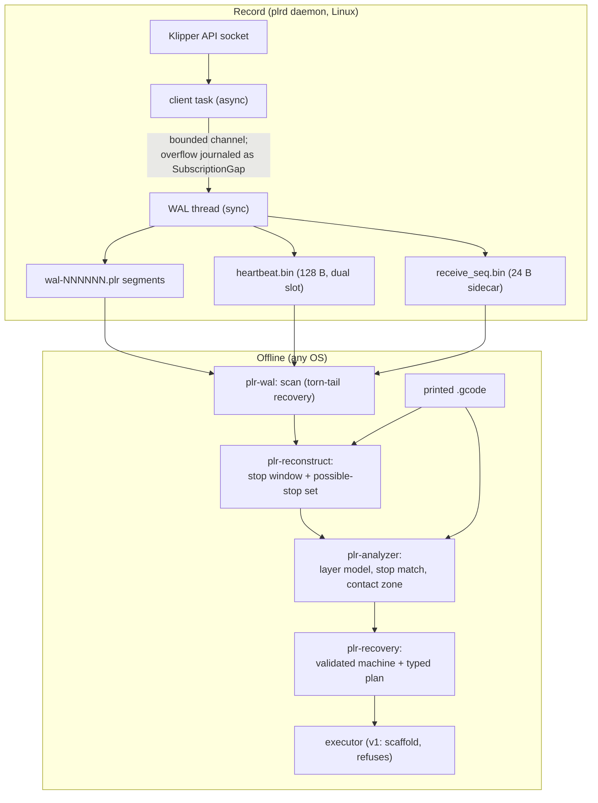

# Architecture

dead-reckoning is a pipeline of four stages — **record**, **reconstruct**,
**analyze**, **plan** — plus an execution stage that in v1 is deliberately a
refusing scaffold. This document describes each stage as the code implements
it, including the on-disk formats, the containment guarantee and its honest
caveats, the probe-envelope math, and the trust model of recovery plans.

Related: [install guide](install.md) · [operations](operations.md) ·
[worked example](../examples/recovery-walkthrough.md).



The workspace enforces the platform split structurally: six pure-logic crates
(no I/O, no syscalls, total on hostile input, property-tested) are the
`default-members` and build everywhere; all syscalls live in the one
Linux-only binary crate `plrd`. Durability code is **never mocked**.

## Stage 1 — Record

### What is journaled

`plrd` subscribes to Klipper's API socket (`motion_report` dumps plus a
status subscription) and appends five record kinds to the WAL
(`plr-wal::record`):

| Kind (tag) | Contents | Durability |
| --- | --- | --- |
| `TrapqSegment` (1) | One trapezoidal move segment per `dump_trapq` row: start position, direction ratios, velocity, acceleration, print-time span. Mirrors Klipper's `pull_move` exactly | batched |
| `StepperRange` (2) | One `dump_stepper` batch per configured Z stepper: committed step chunks with raw MCU clocks — the source of the committed-motion boundary `t_b` | batched |
| `Context` (3) | Print-context snapshot: `virtual_sdcard` file/offset, full `gcode_move` interpreter state, transform observations (bed mesh, `z_thermal_adjust`, skew), heater/fan targets | **immediate** |
| `Marker` (4) | Lifecycle events: `CleanShutdown`, `SocketLost`, `Resubscribed`, `SubscriptionGap` | **immediate** |
| `Heartbeat` (5) | Liveness + clock correlation: monotonic/wall time, latest print time, an (`est_sample_mono_ns`, `est_sample_print_time`) pair anchoring the print-time ↔ host-time correlation, and the WAL append offset | batched (1 Hz into the WAL; 10 Hz into the heartbeat file) |

Every record carries a host-monotonic capture timestamp. Records containing
NaN or infinity are refused at the writer (JSON cannot round-trip them);
finite floats round-trip bit-exactly (`serde_json` with `float_roundtrip`).

### WAL segment format (`plr-wal::frame`)

A segment is a 32-byte header followed by back-to-back record frames. All
integers little-endian:

```text
Segment header (32 bytes):
offset  size  field
0       8     magic, b"PLR-WAL\0"
8       4     format version, u32 (currently 1)
12      8     creation wall-clock time, u64 ns since Unix epoch
20      8     creation host-monotonic time, u64 ns
28      4     CRC32C over bytes 0..28

Record frame (8-byte header + payload + 4-byte trailer):
offset  size  field
0       2     frame magic, [0xD5, 0xAA]   (invalid UTF-8 by design)
2       1     payload format tag (1 = JSON)
3       1     record kind tag (1..=5, table above)
4       4     payload length, u32 (hard cap 1 MiB)
8       len   payload: serde_json bytes of a WalRecord
8+len   4     CRC32C over header + payload
```

JSON payloads are a deliberate choice at this data rate (~1–6 KB/s during
motion): the log stays greppable and debuggable post-mortem, while the
binary frame supplies the length, type, and integrity guarantees JSON lacks.

**Torn writes are the expected case.** Power loss mid-append leaves a
partial frame at the tail. The recovery scan yields records until the first
invalid frame and reports *where* and *why* the valid prefix ends
(`ScanEnd`: clean EOF, torn frame header, torn payload, bad magic, CRC
mismatch, oversized length…). A truncated trailing frame is a normal
outcome, not an error; the decoder never panics and never allocates from an
unvalidated length.

### Heartbeat file (`plr-wal::heartbeat`)

Rewriting one region in place can tear under power loss, so the 128-byte
heartbeat file holds **two alternating 64-byte slots**: sequence `n` goes to
slot A when even, slot B when odd. A torn write can only destroy the slot
being written; the other slot still holds the previous (one tick older)
heartbeat. The reader validates both slots and picks the valid one with the
newest sequence.

```text
Slot layout (64 bytes, little-endian; slot A = file bytes 0..64, B = 64..128):
offset  size  field
0       4     magic + version, b"PHB1"
4       8     sequence, u64 (wrapping counter)
12      8     mono_ns, u64
20      8     wall_ns, u64
28      8     print_time, f64 bits
36      8     est_sample_mono_ns, u64
44      8     est_sample_print_time, f64 bits
52      8     wal_offset, u64
60      4     CRC32C over bytes 0..60
```

Floats are raw IEEE-754 bits here (unlike the JSON WAL payloads), so this
encoding round-trips everything bit-exactly. Across daemon restarts the
sequence resumes from the recovered value + 1 (restarting at 0 would make
the pre-crash slot look newer), and the file is never zeroed: a daemon
restart must not destroy crash evidence.

### receive_seq sidecar (`plrd::seqfile`)

A 24-byte CRC-guarded file (`b"PSQ1"`, `mono_ns` u64, widened `receive_seq`
u64, CRC32C) rewritten in place on every counter advance (~1 Hz from
`mcu.last_stats`). Single-slot is deliberate: a torn write merely loses the
observation, and reconstruction without a receive-seq bound only *widens*
the possible-stop set — the safe direction.

### Durability rules

The WAL thread (`plrd::walsvc`) is the only place in the project where
"durable" becomes a syscall:

- **Motion records** (trapq, stepper): appended immediately, `fdatasync`'d
  on a batch cadence (default 0.5 s — matching Klipper's own 0.5 s dump
  batching, so the extra loss window is at most one batch on top of an
  already-batched source).
- **Markers and contexts**: `fdatasync` immediately after the append. They
  are rare and each one changes what recovery is allowed to do.
- **Heartbeat**: rewritten at the configured rate (default 10 Hz) using the
  dual-slot protocol, then `fdatasync`'d — or written through `O_DSYNC` when
  configured (same guarantee, one syscall instead of two). Every 10th
  heartbeat is also appended to the WAL so the log itself carries
  correlation samples.
- **Segment rotation** (size threshold, default 16 MiB) is crash-ordered:
  (1) `fdatasync` the finished segment, (2) create the successor `O_EXCL`,
  write + `fdatasync` its header, (3) `fsync` the WAL directory — so a
  record acked as durable can never live in a file whose *name* is not
  durable. Appends to the new segment start only after step 3. The daemon
  never resumes an old segment; each start creates a fresh one, leaving
  crash evidence untouched.

The socket side never blocks on the disk: Klipper disconnects unresponsive
clients, so the client task and the WAL thread are separate, joined by a
bounded channel. If the disk stalls and the channel fills, motion records
are dropped **and the drop is journaled** — the first send after a drop is
preceded by a `SubscriptionGap` marker covering the hole, so reconstruction
sees an honest observation gap instead of silently missing motion.
Lifecycle markers are never dropped.

The ack ⇒ durable ordering is verified end-to-end by a SIGKILL
crash-consistency integration test (`crates/plrd/tests/crash_consistency.rs`):
a child appends with per-record `fdatasync` and reports acks over a pipe;
the parent SIGKILLs it at a random moment and asserts every acked record
survives the scan. The test itself is honest about its scope: SIGKILL proves
the *process-death* half of the contract; the power-loss half is exactly
what `fdatasync` is specified to provide (and is part of the open E1–E5
hardware validation).

## Stage 2 — Reconstruct (`plr-reconstruct`)

### The problem, and the shape of the answer

Klipper's motion dumps batch at ~0.5 s and step generation runs 0.4–0.7 s
ahead of execution, so after a power loss the durable WAL can end *before*
the machine actually stopped. Reconstruction therefore produces a **set** of
possible stop states, not a point estimate:

```text
possible-stop set = { state(t) : t ∈ [t_a, wal_eval_end] }   (from the WAL)
                    ∪ forward-simulated extension            (from the file)
```

- **`t_a`** — the machine was provably alive and executing at `t_a`: it
  comes from the newest finite heartbeat (heartbeat file or WAL record,
  whichever is newer). Because a heartbeat's own `print_time` can run
  *ahead* of execution (trapq rows are planned ahead), `t_a` is
  `min(heartbeat.print_time, estimated print time at heartbeat.mono_ns)` —
  a deflated `t_a` merely widens the window, an inflated one would wrongly
  exclude possible stop states.
- **`t_b`** — end of *committed* motion, from Z-stepper `dump_stepper`
  history: the newest committed step time across the configured Z steppers,
  converted from raw MCU clocks when the MCU frequency is known (it is not
  journaled yet in v1, so the Klipper-converted `last_step_time` is used and
  a `NoMcuFrequency` anomaly is reported). The widened `receive_seq`
  observation is applied **as a time bound only** and can only widen the
  window. Fallbacks (no Z history → any stepper; nothing at all → `t_a`)
  are all typed anomalies.
- **The forward extension** simulates the G-code from the last recorded
  context (file offset + interpreter state) for a horizon of 2 s of
  simulated motion plus catch-up when the context lags `t_b`. Because the
  simulator's per-line time accounting is a documented *lower bound* on real
  durations, the horizon covers at least that much real machine time.

### The guarantee, and its honest caveats

**The true stop state is always contained in the set.** This is enforced in
miniature by a fault-injection property test that synthesizes WALs with
honest 0.5 s batch flushing, torn tails, and random power-cut points, and
asserts containment of the true Z, XY, E, and file offset for every cut.

The caveats, exactly as the code states them:

- **Z is exact; XY/E are bounds.** The Z projection is an enumerable
  candidate list — `{z_layer, z_layer − hop}` plateaus plus short ramp
  intervals at worst, each with provenance (`Wal`/`Extension`) and a
  knowledge flag — because Z sizes the probe envelope and an unexpected
  Z-touch crashes the nozzle into the print. XY is a bounding region and E a
  pair of intervals (Klipper-internal frame and file frame), because their
  timing fidelity only affects line-match granularity.
- **No file, no guarantee.** If the printed file (or `virtual_sdcard` state)
  is unavailable, the extension cannot run and **the containment guarantee
  is void for true power loss** — only WAL evidence is reported, flagged
  `extension_unavailable`.
- **Degradations never silently shrink the set.** Subscription gaps,
  truncated extensions, unparseable lines, G28-invalidated knowledge, an
  uncertain offset floor — each is a typed flag in `Degradation`, with an
  overall per-line vs per-layer confidence.
- **Widening is always the safe direction.** WAL evaluation extends past
  `t_b` to the end of durable trapq data (planned-but-maybe-never-executed
  motion), receive-seq bounds only widen, and clock disagreements resolve to
  the larger value.

### Crash classes

Classification never narrows the stop set; it exists for reporting and
policy:

- **`CleanShutdown`** — a `CleanShutdown` marker ends the WAL: the print
  ended on purpose. Reported distinctly; no recovery is ever built.
- **`ShutdownPowerRetained`** — klippy/MCU shut down while host power stayed
  up; the daemon demonstrably outlived motion (a `SocketLost` marker with no
  later resubscription, or a quiet tail where heartbeats postdate motion by
  > 2 s). Honesty limit, documented in the code: a power cut during a long
  *dwell* produces the same signature — the verdict is then wrong about the
  cause but right about the position, and the extension runs regardless, so
  containment is unaffected.
- **`HostDeathOrPowerLoss`** — the log simply ends (with or without a torn
  tail). Host death with the MCU alive and true power loss are
  **indistinguishable from the WAL alone** and handled identically and
  conservatively. A documented edge case: if all heaters were cold at the
  crash, no PWM watchdog fires and the MCU idles with drivers energized —
  recovery policy must not assume the machine de-powered itself.

The klippy.log cross-check mentioned in the design is deliberately **not**
an input: classification depends only on durable local evidence.

## Stage 3 — Analyze (`plr-analyzer`)

Three components, all replaying the byte-exact `plr-gcode` parser so
positions live in the same Klipper-internal frame as the WAL data:

- **Layer model** — streams a byte window into geometric layers with
  per-`;TYPE:` extrusion polylines (annotations classify, geometry decides)
  and the full simulated move stream.
- **Stop matcher** — answers *"where in the file did we stop?"* from the
  possible-stop set, with honest granularity: unique line, ambiguous window,
  or layer-only. Ambiguity never degrades Z correctness.
- **Contact-zone selection** — answers *"where do we probe?"*: ranked probe
  points on layer N−1 plastic that layer N will bury (probe marks must end
  up invisible), sampled mid-segment, never on outer walls, surfaces,
  bridges, gap fill, skirts or support, ranked infill-first, and excluding a
  radius around the crash point (blob risk). When no safe zone exists it
  **declines with a typed reason** (vase mode, single wall, no safe zone,
  missing `;TYPE:` annotations) — a decline degrades planning to manual
  fallback, never to a risky probe.

## Stage 4 — Plan (`plr-recovery`)

### Machine gate

`validate_machine` checks every structural prerequisite (the
[commissioning checklist](install.md#commissioning-checklist): force_move,
attested self-locking Z, single-MCU Z steppers, `;TYPE:` annotations,
exactly one Tap/load-cell probe with move-free activate G-code, known Z
`position_min`, virtual_sdcard root, config hash unchanged since
validation) and reports **every** failure, not just the first. No plan is
built for a machine that fails any check.

### The probe envelope and the shifted frame

The machine's bed rises into a fixed gantry: XY can be re-homed at will, but
**Z must never be re-homed**. Every Z motion in a recovery is a bounded move
inside a frame the plan declares explicitly:

```text
envelope = expected_gap + 0.15 s × probe_speed + margin
```

- `expected_gap` — the Z span of the possible-stop set plus a sag allowance:
  how far apart the plausible nozzle heights are;
- `0.15 s × probe_speed` — Klipper keeps stepping for ~0.15 s after a probe
  trigger while the drip-move flush horizon drains;
- `margin` — configured slack (default 0.5 mm).

The plan declares `SET_KINEMATIC_POSITION Z = position_min + envelope`
before probing; the probing move then targets `position_min`, so **Klipper's
own rail-limit checking structurally bounds the descent** — even with a
faulty or disconnected probe the toolhead may reach but never pass
`position_min`. No trust in the probe is required for the descent bound,
only for the measurement.

Probe speed is hard-capped to **[1, 2] mm/s** and out-of-band speeds are
**rejected, never clamped** (clamping would silently substitute a speed the
caller did not ask for). At 1 mm/s the post-trigger travel is ~0.15 mm of
indentation into warm plastic, which the true-Z arithmetic absorbs; the
band's floor exists because the safety analysis was validated for [1, 2]
only, and because slower speeds park a hot nozzle near the part for
arbitrarily long.

The probe is a single bounded `PROBE PROBE_SPEED=<v> SAMPLES=1` — one
sample, so the toolhead rests exactly at the halt position, and the true Z
at halt is computed as:

```text
true_Z_at_halt = z_prev_top + (halt − trigger)
```

where `trigger` is the **raw** trigger Z (read per probe type: Tap probes
expose it as `probe.last_z_result`; load-cell probes report `bed_z` with
`z_offset` subtracted, so the formula adds it back) and `halt` is the raw
kinematic `toolhead.position[2]` — never `gcode_move.position`, which reads
back through the transform stack.

### The plan is data; the trust model

A `RecoveryPlan` is a strictly ordered list of typed steps. The crate never
executes anything; each step carries:

- **commands** — the G-code / extended commands to send, in order (the only
  placeholder is `{true_z}`, substituted by the executor from the typed
  formula above — an executor must abort, never substitute, if the formula
  evaluates non-finite);
- **pre_verify / verify** — machine-readable predicates over named Klipper
  status fields (`NumWithin`, `TempWithin`, `Contains`, `BoolTrue`,
  `NonEmptyMatrix`, …) that must hold before / after the commands.
  Slow-converging predicates (temperatures) are polled until they hold or a
  timeout fires — a timeout is a verification failure;
- **on_failure** — always `Abort` with a typed reason code in v1. The
  executor contract: **never continue past a failed verification**.

The builder emits phases in a fixed order, and the ordering is not just
convention — it is checked by invariant accessors used in tests
(`idle_timeout_first`, `steppers_enabled_before_motion`,
`temp_verify_precedes_probe`, `no_g28_after_shifted_declare`, …):

1. `idle-timeout` — disarm the idle timeout FIRST (its default `M84` would
   clear all homed state; a later naive `G28` would crash the bed into the
   nozzle)
2. `stepper-enable` — energize Z steppers (enabling never touches homed
   state)
3. `preheat` — bed to target; nozzle to the warm-but-below-ooze band
   (140–160 °C)
4. `home-xy` — `G28 X Y` only; never bare `G28`, never Z
5. `transform-freeze` — freeze `z_thermal_adjust` before the shifted frame
   (when configured)
6. `shifted-frame` — `SET_KINEMATIC_POSITION` per the envelope
7. `probe-approach` — XY travel to the selected contact point (no Z motion)
8. `probe` — the single-sample probe, with a mandatory nozzle-temperature
   pre-check (no probe type has a temperature interlock of its own)
9. `true-z-declare` — the true-Z arithmetic and kinematic re-declaration
   (never a G-code offset)
10. `mesh-load` — load the bed-mesh profile (probe already done, so the
    probe was transform-free)
11. `final-declare` — final true-frame declaration
12. `restore-frame` — a bounded relative Z **lift off the part first** (the
    nozzle must not dwell at print temperature pressed into plastic while
    temperature verification polls), then offsets, factors, skew, print
    temperatures, fans, feedrate
13. `entry` — enter from above the part interior, speed-limited (≤ 30 mm/s),
    prime, restore E frame and modes
14. `file-select` — `M23` (top-level files only), restore exclude-object
    state, `M26 S<byte>` to a line-boundary offset
15. `resume-start` — `M24`

A rendered plan (from the checked-in golden test output) is shown in the
[walkthrough](../examples/recovery-walkthrough.md#the-recovery-plan).

Planning outcomes are typed: `NoRecoveryNeeded` (clean shutdown),
`Plan(...)`, or `ManualFallback { reason }` — contact zone declined, match
too coarse (layer-only), no depositing move at the resume point, resume
position unknown. Plans also carry typed warnings, e.g.
`AdaptiveMeshNotRestorable`: a WAL that shows an active mesh with no
loadable profile name (adaptive meshes have empty names) cannot be restored
— the plan **warns and continues without the mesh** rather than failing or
guessing.

Additionally, any user macro text an executor would run must pass the
lethal-command guard scan first: `G28`, `Z_TILT_ADJUST` and
`QUAD_GANTRY_LEVEL` are stripped (commented occurrences are reported but
inert; Jinja-templated occurrences are conservatively treated as live).

## Stage 5 — Execute (v1: scaffold that refuses)

`crates/plrd/src/executor.rs` pins down the executor's shape (a Moonraker
WebSocket JSON-RPC client walking the plan) but its `execute` returns
`ExecutorError::NotImplemented` unconditionally. This is deliberate:
executing a recovery moves a hot nozzle around a solidified print, so the
implementation ships only together with its own safety review. In v1,
recovery execution is a human activity guided by a rendered plan — see
[operations](operations.md#after-a-real-power-loss).

## Time correlation (`plr-klipper`)

Three clock domains meet in the WAL: host-monotonic nanoseconds (every
record), wall-clock time (headers and heartbeats, for humans), and Klipper
print time (motion). Heartbeats carry an
(`est_sample_mono_ns`, `est_sample_print_time`) pair anchoring a unit-slope
linear correlation (`ClockCorrelator`); raw MCU clocks convert via
`clock / freq` (`McuClock`) when the frequency is known; and the 32-bit
`receive_seq` counter is widened to 64 bits (`ReceiveSeqWidener`) before its
observation time is used as a `t_b` bound.
